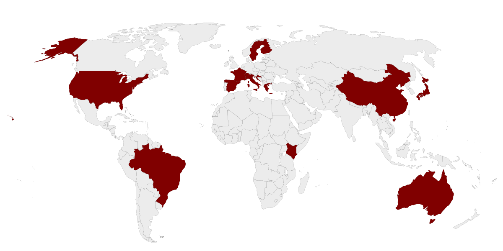

# Willkommen beim Projekt Traveller
Ersteller: Raphael Brunold  
Modul: Frontend Entwicklung  

<div align="center">
    
</div> 

Link zur Webseite:  
https://frontend-project-2024.vercel.app/

Auf dieser Webseite können Nutzer und Nutzerinnen ein Reisejournal anlegen.  

Dieses Projekt wurde mit **Vue.js** und **Nuxt.js** erstellt. Für die Authentifizierung und Datenverwaltung wird **Supabase** verwendet.

## Hauptfunktionalitäten
- Registrierung & Login
- Erfassen von Journaleinträgen
- Erstellung einer Tabelle mit den Journaleinträgen
- Editieren und Löschen von Einträgen
- Erstellung einer Karte mit den besuchten Ländern
- Testing mit Cypress

 ## Projektstruktur
- **components** - Wiederverwendbare Komponenten
- **layouts** - Wiederverwendbare Layouts
- **stores** - Pinia Data Stores
- **pages**
    - **index.vue** - Landing Page mit Login & Registrierung
    - **user-[id].vue** - Persönlicher Bereich mit dynamischem Routing
    - **edit.vue** - Bearbeitung und Löschen von Einträgen
    - **map.vue** - Visualisierung der Einträge auf einer Weltkarte
- **cypress** - Automatisiertes End-to-End-Testing
    - Der Login, das Erstellen, das Editieren und das Löschen von Einträgen wird automatisiert getestet.
- **assets** - Verwendete Bilder

## Install

Dependencies installieren:

```bash
npm install
```

## Development Server

Development Server starten auf `http://localhost:3000`:

```bash
npm run dev
```
